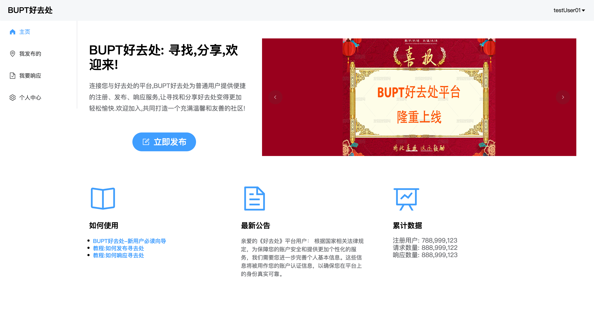
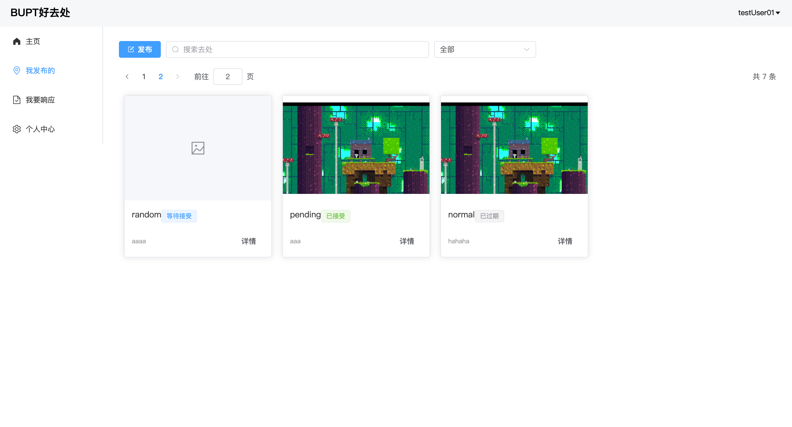
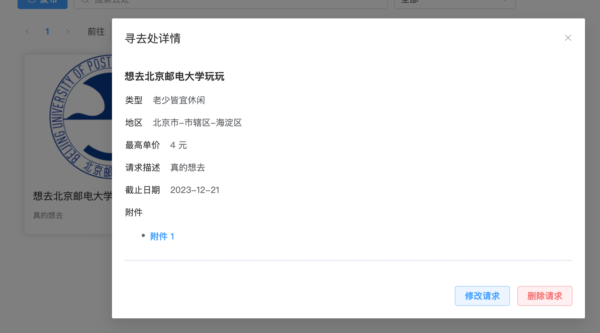
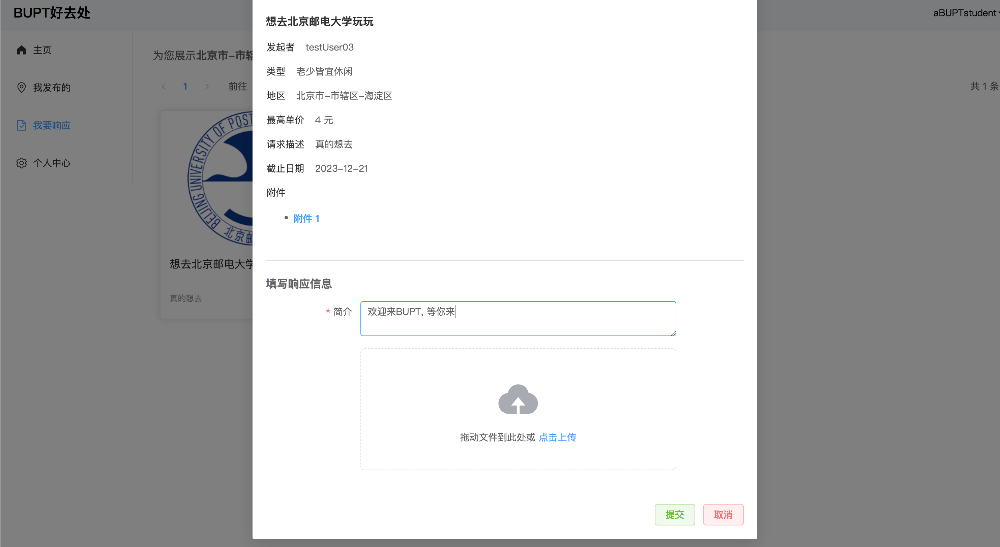
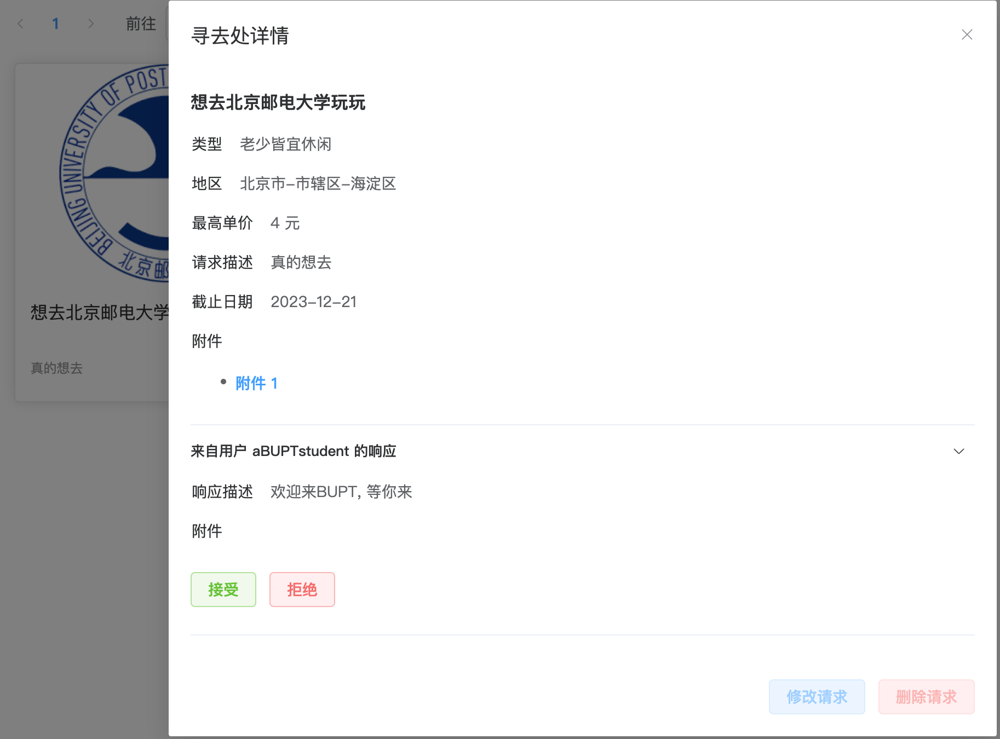
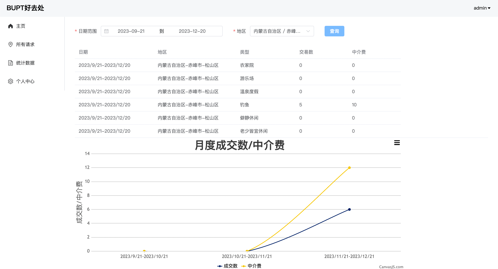

# BUPT好去处

Web开发技术课程作业.

前端: [ goverclock ](https://github.com/goverclock)

后端: [ zsc-124 ](https://github.com/zsc-124)

[ 接口文档 ](JSON.md)

---

# **运行环境配置说明**

- IDE: IDEA, VSCode
- OS: Windows10(开发), macOS(开发) Debian GNU/Linux 11 (bullseye) aarch64(部署)
- 数据库：MariaDB
- 数据库备份导出文件名称：goodplaces.csv、welcome.csv、users_information.csv、incometable.csv、javaweb_mysql.txt
- 开源框架：SpringBoot, MyBatis, Vite+Vue.js+Element Plus
- 其它关键技术：Selenium测试, 阿里云对象存储OSS
- 工程名称：BUPT-good-place
- 访问URL：<服务器IP地址>:5173/#/login
- 管理员用户名、密码：admin, admin
- 可测试的一个普通用户名、密码：User01, User01
- 关键配置文件名称及路径
    - javaweb_mysql.txt中有建表语句 也可以用*.csv文件直接导入到数据库
    - frontend/.env: 填写服务器IP地址或域名(勿换行)

# **已实现功能说明**

前端关键路径

| 编号 | 功能点说明 | 前端关键页面路径 | 工程实现对应代码模块 |
| --- | --- | --- | --- |
| 1 | 网站主页: 用户登录后自动跳转到的网站概览页面 | /#/home | frontend/src/views/home.vue |
| 2 | 登陆页面: 未登录用户访问站点时自动跳转到此页面 | /#/login | frontend/src/views/login.vue |
| 3 | 注册页面: 提供普通用户注册功能(不含管理员) | /#/register | frontend/src/views/register.vue |
| 4 | 用户信息详情页面: 供用户查看自己的个人信息, 可以在此编辑资料或修改密码 | /#/user/detail | frontend/src/views/user/detail.vue |
| 5 | 编辑资料页面: 供用户修改个人资料 | /#/user/edit | frontend/src/views/user/edit.vue |
| 6 | 修改密码页面: 供用户修改账号密码 | /#/user/change_pass | frontend/src/views/user/change_pass.vue |
| 7 | 实名认证页面: 供用户进行实名认证 | /#/user/verify | frontend/src/views/user/verify.vue |
| 8 | 寻去处页面: 为普通用户提供寻去处模块的一系列功能入口(CRUD); 为管理员用户展示系统内所有请求和请求发起者 | /#/wheretogo | frontend/src/views/wheretogo.vue |
| 9 | 欢迎来页面: 提供欢迎来模块的一系列功能入口 | /#/welcome | frontend/src/views/welcome.vue |
| 10 | 统计数据页面: 仅供管理员使用, 可查询限定条件的数据并以表格和折线图形式展示 | /#/stat | frontend/src/views/stat.vue |
| 11 | 404页面 | /#/404 | frontend/src/views/404.vue |

后端与前端的访问接口：

| 编号 | 功能点说明 | 前端关键页面路径 | 工程实现对应代码模块 |
| --- | --- | --- | --- |
| 1． | 获取用户信息 | /get_user_information | Result get_user_information
(@RequestBody User user) |
| 2. | 用户修改密码 | /update_password | Result update_password
(@RequestBody User_Tmp user) |
| 3. | 用户注册 | /register | Result user_register
(@RequestBody User user) |
| 4. | 用户登录 | /load | Result user_load
( @RequestBody User user) |
| 5. | 用户更新信息 | /update_information | Result user_update
( @RequestBody User_Tmp user) |
| 6. | 用户发布寻去处请求接口 | /findplace | Result find_goodplace（）
空间有限，参数省略 |
| 7. | 用户查询寻去出请求的信息 | /query_request | Result query(@RequestBody GoodPlace goodPlace ) throws Exception |
| 8. | 查询用户的寻去出请求的相关的欢迎来响应信息 | /query_response_by_requestid | Result query_response_by_requestid
(@RequestBody GoodPlace goodPlace) throws Exception |
| 9. | 用户修改已发布但还未响应的寻去出的请求的信息 | /request_update | Result request_update()
空间有限，参数省略 |
| 10. | 用户删除已发布但是还未响应的寻去出的请求信息 | /request_delete | Result request_delete
(@RequestBody GoodPlace goodPlace) throws Exception |
| 11. | 用户查询本人的所有寻去出请求信息 | /query_request_by_user_id | Result query_request_by_user_id
(@RequestBody User user) throws Exception |
| 12. | 用户接受欢迎来请求 | /accept_response | Result accept_response
(@RequestBody Welcome welcome) |
| 13. | 按地域查询所有寻去出请求 | /query_request_by_city | Result query_request_by_city
(@RequestBody GoodPlace goodPlace ) throws Exception |
| 14. | 用户提交欢迎来响应 | /response | Result response()
空间有限，参数省略 |
| 15. | 用户修改自己已提交但是还未被接受的欢迎来响应 | /response_update | Result response_update()
空间有限，参数省略 |
| 16. | 用户删除自己已提交但是还未被接受的欢迎来响应 | / response_delete | Result response_delete
(@RequestBody Welcome welcome) throws Exception |
| 17. | 按起始年月、终止年月、某个地域的寻去出请求查询达成的中介费与笔数明细 | /query_profit | Result query_profit
(@RequestBody Order order) |
| 18. | 按月份查询中介费与笔数的明细 | /query_profit_by_month | Result query_profit_by_month
(@RequestBody Order order) throws ParseException |
| 19. | 完善用户身份证信息 | /verify | Result verify(@RequestBody User user) |
| 20. | 拒绝用户欢迎来响应 | /reject_response | Result reject_response(@RequestBody Welcome welcome) |

详细可见[接口文档](JSON.md)

# 关键界面截图及说明

1. **主页**

用户登陆成功后自动跳转到此页面, 可在此查看最新公告信息.

1. **寻去处**

显示用户已经发布的所有寻去处请求, 点击卡片可以编辑已发布请求, 点击左上角发布按钮可发布新请求.

1. **欢迎来**

显示用户所在地区的寻去处请求, 点击一个请求卡片后可以选择响应. (图示: 用户aBUPTstudent正在响应testUser03发起的请求)

此后, testUser03可以在寻去处页面选择接受或拒绝这个响应:

1. **管理员统计页面**

该页面仅供管理员访问, 选择日期范围和地区后点击查询即可获得交易数与中介费数据, 以表格和折线图表示.

# 部署(Linux)

- 后端

确认`MariaDB`已经作为系统服务启动,在`backend`目录下启动已经打包好的后端程序:`java -jar ./javaweb-1.0-SNAPSHOT.jar`

- 前端
1. 在`frontend`目录下编辑`.env`文件,在其中输入服务器的公网IP或域名
2. 运行`run.sh`